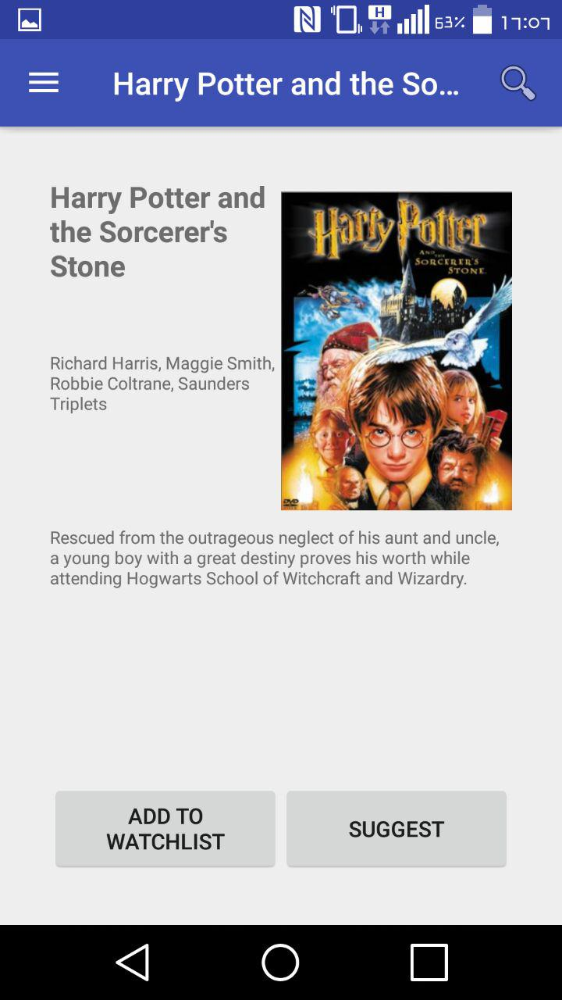
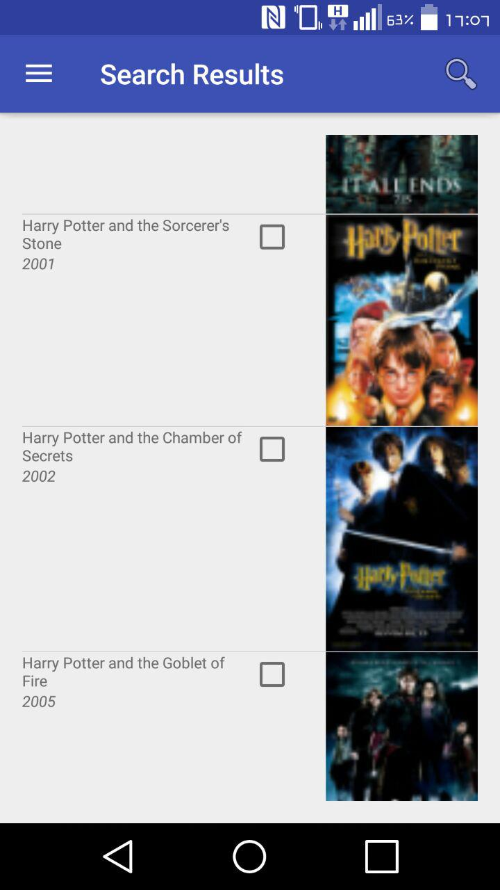
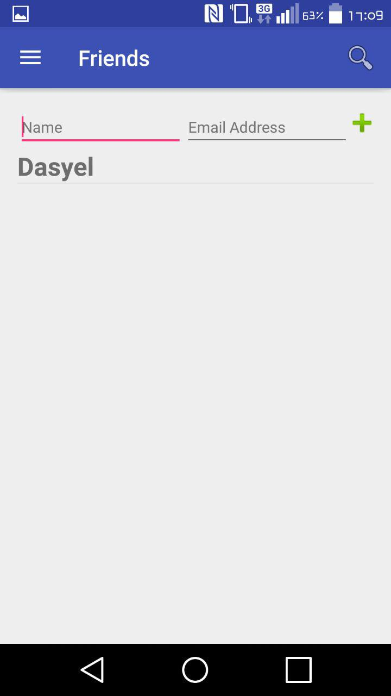
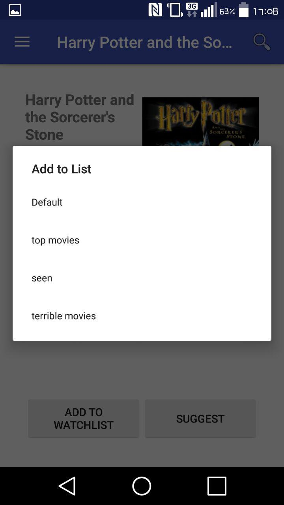

# DasyelWillems-pset6 (Movies)
student: Dasyel Willems (10172548)
The sixth problem set app for Native Appstudio.
## Description
This app lets the user create an account and login after which the 
user can search for movies and add them to to any of the self-managed 
lists. This lets the user keep track of multiple lists. For example:
the user can keep a list of watched movies, movies to watch and 
favorite movies.
The user can manage a list of friends to which they can send movie 
suggestions.

## Usage
- Add lists through the side drawer menu
- Delete lists by long-pressing any list in the side drawer menu
- Add movies by pressing the corresponding button in the movie details view
- Remove movies by long-pressing a movie in a list.
- Friends can be managed through the friends menu found in the side drawer.
***
- Note that the default, search results and suggestions list cannot be removed as they are crucial to the performance of the app.

## Screenshots

